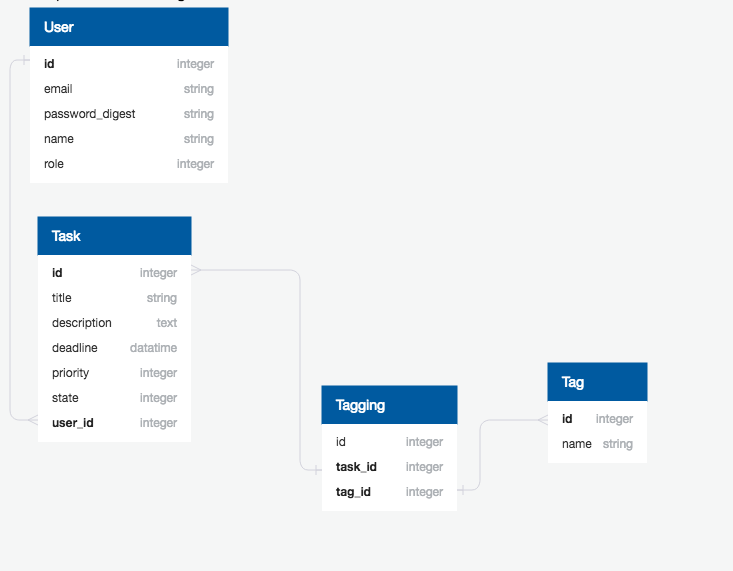

# README

This README would normally document whatever steps are necessary to get the
application up and running.

Things you may want to cover:

* Ruby version
2.5.0

* Rails version
5.2.0

* Table Schema
- Model User
>email:string, password_digest:string, name:string, role:integer

- Model Task
>title:string, description:string, deadline:datetime, priority:integer, state:integer, user_id:integer

- Model Tagging
>tag_id:integer, task_id:integer

- Model Tag
>name:string



* System dependencies

* Configuration

* Database creation

* Database initialization

* How to run the test suite

* Services (job queues, cache servers, search engines, etc.)

* Deployment instructions
> Before deployment,please install following tools： 
> >   Heroku CLI  : https://devcenter.heroku.com/articles/heroku-cli#download-and-install  
> >   Git         : https://git-scm.com/book/en/v2/Getting-Started-Installing-Git 

>	Deploy to Heroku
> 1. Download this project to your local repo

> 2. Open your project
```bash
$ cd "your project location"
```

> 3. Login with Heroku account and create new App
```bash
$ heroku login
$ heroku create
```

> 4. Deploy this app with Heroku CLI commands
```bash
$ git push heroku master
```

>	5. Initial db
```bash
$ heroku run rails db:migrate
```

>	6. Create User
```bash
$ heroku run rails console
$ User.create(email: "your emrail", password: "your password")
$ exit
```

> 7. Open your app with Heroku CLI commands
```bash
$ heroku open
```

> 8. Login with User and enjoy the app!
